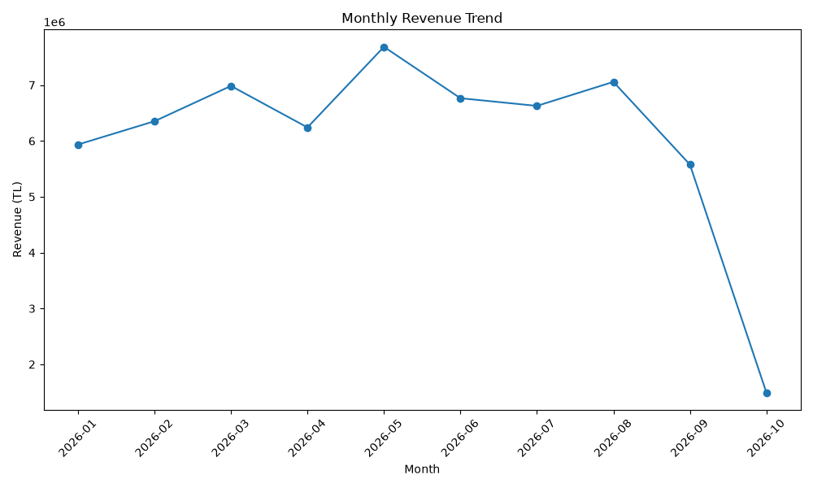
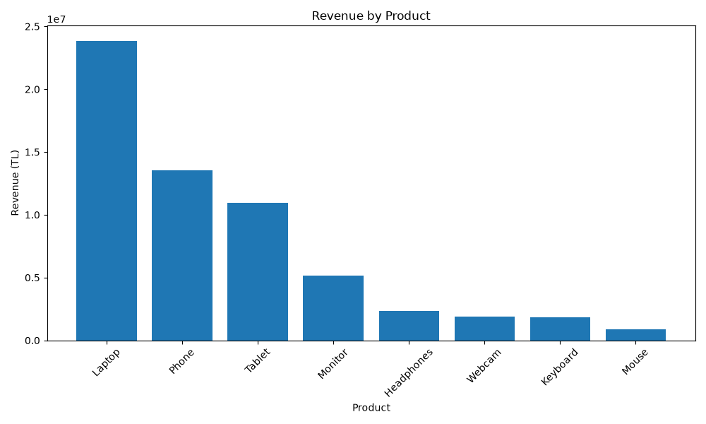
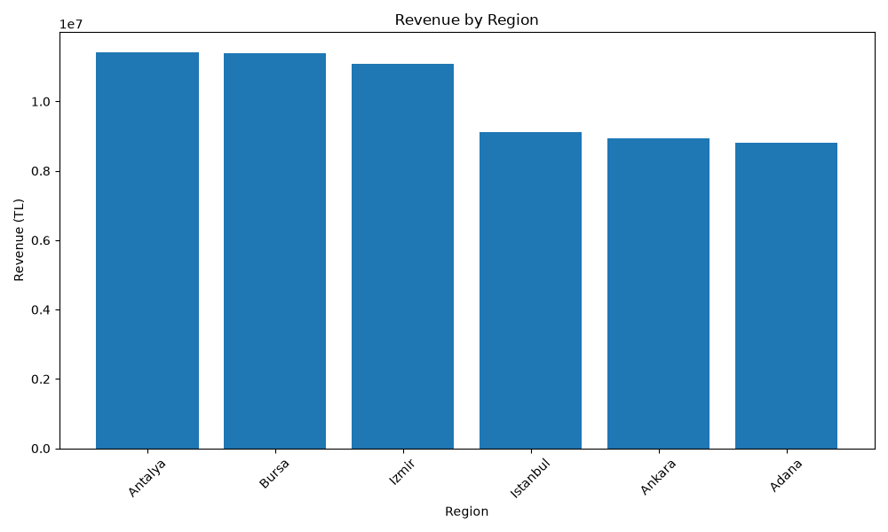

# AI Sales Analytics

An end-to-end sales analytics and AI-powered business reporting system built with Python, Pandas, SQLite, SQL, Matplotlib, and Google Gemini API.

The project processes sales data, validates the dataset, stores the data in a relational database, calculates business KPIs, analyzes product, regional and monthly performance, generates visual reports, and uses generative AI to produce an executive-level business report.

---

## Project Overview

AI Sales Analytics is designed as a small-scale business intelligence pipeline.

The system transforms raw sales data into structured analytics and actionable business insights.

### Data Pipeline

```text
sales_data.csv
      │
      ▼
Data Validation
      │
      ▼
SQLite Database
      │
      ▼
Pandas Analytics
      │
      ├───────────────┐
      ▼               ▼
     KPIs        Business Analysis
      │               │
      ├───────┬───────┤
      ▼       ▼       ▼
   Product  Region  Monthly
   Analysis Analysis Analysis
      │       │       │
      └───────┴───────┘
              │
              ▼
       Matplotlib Reports
              │
              ▼
        Business Report
              │
              ▼
          Gemini AI
              │
              ▼
    Executive Business Report
```

---

## Features

- Sales data generation
- CSV data processing
- Data validation
- Missing-value detection
- Numeric data validation
- Revenue consistency validation
- SQLite database integration
- SQL analytics queries
- KPI calculation
- Product performance analysis
- Regional performance analysis
- Monthly revenue analysis
- Top-product analysis
- Matplotlib visualizations
- Automated business report generation
- Google Gemini AI executive reporting
- Partial current-month detection
- Unit testing with Python `unittest`

---

## Key Performance Indicators

The system calculates:

- Total Revenue
- Total Quantity Sold
- Average Revenue per Transaction

It also identifies:

- Best-performing product
- Best-performing region
- Best completed month
- Lowest completed month
- Top products

---

## AI Business Reporting

Google Gemini API is used to transform the generated business report into an executive-level report.

The AI report contains:

1. Executive Summary
2. Key Findings
3. Product Performance
4. Regional Performance
5. Monthly Performance
6. Business Recommendations

The AI prompt is designed to:

- Use only provided information
- Avoid inventing facts
- Distinguish facts from recommendations
- Avoid unsupported causal explanations
- Handle incomplete current-month data correctly

---

## Database & SQL

The project uses SQLite for structured data storage.

The database is generated automatically by the application and is excluded from version control.

Example SQL analysis:

```sql
SELECT
    product,
    SUM(revenue) AS total_revenue
FROM sales
GROUP BY product
ORDER BY total_revenue DESC;
```

Regional performance:

```sql
SELECT
    region,
    SUM(revenue) AS total_revenue,
    SUM(quantity) AS total_quantity
FROM sales
GROUP BY region
ORDER BY total_revenue DESC;
```

---

## Data Validation

Before entering the analysis pipeline, the dataset is validated for:

- Required columns
- Missing values
- Numeric values
- Positive quantities
- Positive unit prices
- Positive revenue values
- Revenue consistency

Revenue is validated using:

```text
quantity × unit_price = revenue
```

This prevents invalid data from entering the analytics pipeline.

---

## Testing

The project uses Python's built-in `unittest` framework.

Current test coverage includes:

- KPI calculations
- Product analysis
- Regional analysis
- Monthly analysis
- Top-product analysis
- Required-column validation
- Missing-value validation
- Negative-value validation
- Revenue consistency validation
- SQLite database creation
- SQLite data storage and retrieval

Run all tests:

```bash
python -m unittest discover -s tests -v
```

Current status:

```text
14 tests passed
```

---

## Generated Reports

The project automatically generates:

```text
reports/
├── ai_business_report.txt
├── business_report.txt
├── monthly_revenue.png
├── product_revenue.png
└── region_revenue.png
```

### Monthly Revenue Trend



### Revenue by Product



### Revenue by Region



---

## Technologies

- Python
- Pandas
- SQLite
- SQL
- Matplotlib
- Google Gemini API
- python-dotenv
- unittest
- Git
- GitHub

---

## Project Structure

```text
AI Sales Analytics/
│
├── data/
│   └── sales_data.csv
│
├── database/
│   └── queries.sql
│
├── reports/
│   ├── ai_business_report.txt
│   ├── business_report.txt
│   ├── monthly_revenue.png
│   ├── product_revenue.png
│   └── region_revenue.png
│
├── src/
│   ├── ai_report.py
│   ├── analyzer.py
│   ├── business_report.py
│   ├── data_loader.py
│   ├── database.py
│   ├── generate_data.py
│   ├── main.py
│   └── report.py
│
├── tests/
│   ├── test_analyzer.py
│   ├── test_data_loader.py
│   └── test_database.py
│
├── .gitignore
├── README.md
└── requirements.txt
```

---

## Installation

Clone the repository:

```bash
git clone https://github.com/ozcanfatih551/ai-sales-analytics.git
```

Navigate to the project directory:

```bash
cd ai-sales-analytics
```

Create a virtual environment:

```bash
python -m venv .venv
```

Activate it on Windows:

```bash
.venv\Scripts\activate
```

Install dependencies:

```bash
pip install -r requirements.txt
```

Create a `.env` file:

```env
GEMINI_API_KEY=your_api_key_here
```

---

## Usage

Run the complete analytics pipeline:

```bash
python src/main.py
```

The application will:

1. Load and validate the sales dataset.
2. Create/update the SQLite database.
3. Load the data from SQLite.
4. Calculate KPIs.
5. Analyze products and regions.
6. Analyze monthly performance.
7. Generate charts.
8. Generate a business report.
9. Send the report to Gemini.
10. Generate an executive AI report.

---

## Limitations

This project uses a synthetic sales dataset created for educational and portfolio purposes.

The analytics should therefore not be interpreted as real-world business performance.

The AI-generated recommendations are based only on the provided dataset and should be reviewed by a human before being used for real business decisions.

---

## Future Improvements

Potential future improvements include:

- n8n workflow automation
- Automated email/report delivery
- Interactive dashboards
- Additional business KPIs
- More advanced forecasting
- Anomaly detection
- Larger real-world datasets
- Role-based dashboard access

---

## Author

**Fatih Özcan**

Management Information Systems Student  
Computer Engineering Double Major Student

GitHub:  
https://github.com/ozcanfatih551